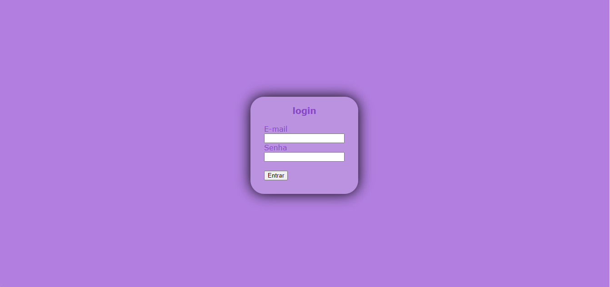

## Projeto - pagina de login

Projeto criado como parte avaliativa da disciplina de Fundamentos de Desenvolvimento ministrada pelo professor Leonardo Rocha.

## índice

* [Descrição](#descrição)
* [Tecnologias](#tecnologias)
* [Referencias](#referencias)
* [Autor(a)](#autora)

## Descrição 

O projeto consiste na composição de um formulario que conta com um login com email e senha para abrir um aplicativo.

### Resultado do projeto 



### Estilização

O projeto foi estilizado, utilizando CSS3. Foi criado um arquivo chamado login.css.
Neste arquivo, constam as seguintes configurações de estilo:

* Estilo de cores - a cor de fundo utilizada no projeto foi definida como segue:

```
body{
 background-color: rgb(178, 127, 225);
}
```

O elemento citado acima foi utilizado nas seguintes classes do CSS3

* .form
* body - É para representar tudo o que aparece na página

O comportamento do elemento "body" e "container" na página foi definida como:

```
.container{
    display: flex;
}
```
```
.body{
    display: flex;
 }
 ```
 * div - Uma tag div é uma tag que define divisões lógicas no conteúdo de uma página da Web. Você pode usar tags div para centralizar blocos de conteúdo, criar efeitos de coluna, criar diferentes áreas de cor e muito mais.
 * form -  É o elemento que formalmente define o formulário e os atributos que definem a maneira como esse formulário se comporta. Sempre que você desejar criar um formulário HTML, você deve iniciá-lo usando este elemento, colocando todo o conteúdo dentro deste.
 * input -  É usado para criar controles interativos para formulários baseados na web para receber dados do usuário.
 * button - ~´É utilizada para inserir interatividade em uma página ou formulário e tem como função executar uma determinada ação ao receber um clique do usuário. 
 * label - É utilizada para inserir interatividade em uma página ou formulário e tem como função executar uma determinada ação ao receber um clique do usuário. 
* h3 - Informam o assunto da página para os mecanismos de busca.
* padding - A propriedade padding define uma a distância entre o conteúdo de um elemento e suas bordas. É um atalho que evita definir uma distância para cada lado separadamente.
* justify-content - controla o alinhamento de todos os itens no eixo principal. 
* Heigth - A propriedade height do CSS determina a altura da área do conteúdo de um elemento.
* font-family - permite que se faça uma lista de prioridades de familias de fontes e/ou nomes genéricos de famílias a serem especificados para um elemento selecionado.
* text-align -  A propriedade CSS text-align descreve como conteúdo inline, como texto, é alinhado no elemento pai em bloco.
* box shadow - O box-shadow é uma propriedade do CSS, é utilizado para adicionar efeitos de sombra em volta de um elemento.
* border-radius - Permite atribuir aos elementos bordas arredondadas.
* padding-top - A propriedade padding define uma a distância entre o conteúdo de um elemento e suas borda.
* color - A propriedade CSS color é utilizada para definir a cor do texto em um determinado elemento ou para toda a página HTML. 
* width - A propriedade CSS width determina a largura da área de conteúdo de um elemento. 
* display - O elemento gera uma caixa de elemento de bloco que estabelece um novo contexto de formatação de bloco, definindo onde está a raiz de formatação. 
* align-items - controla o alinhamento de todos os itens no eixo transversal.


## Tecnologias

* HTML
* CSS3
* README
* Git
* GitHub

## Referencias

[alura](https://www.alura.com.br/artigos/escrever-bom-readme)

## Autor(a)

 Projeto criado pela aluna:
 Ana Karoline Rodrigues Vieira

